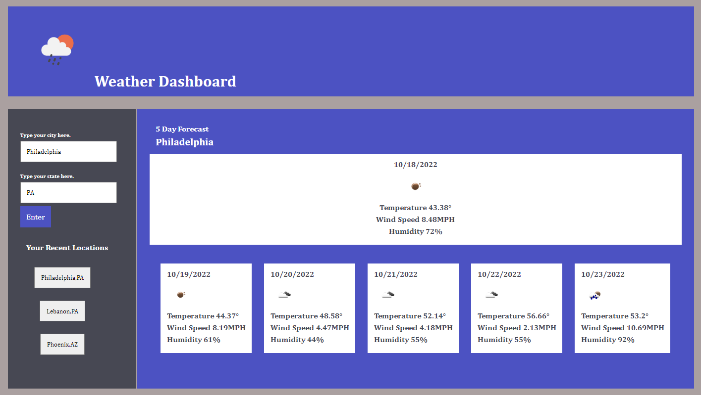

# weather-dashboard

The Weather Dashboard uses an API from Openweathermap.org [5 Day Weather Forecast](https://openweathermap.org/forecast5) to present the user with a 5 day forcast when entering their city and state.  The Weather Dashboard also saves to their local storage city and state weather forecasts they have viewed in the past.

## User Story

A user is traveling to Pheonix Arizona and wants to know what the weather will be like in order to plan accordingly.  They go to the Weather Dashboard and type in the city and state and hit enter.  The user will then be presented with the current conditions and below that, a 5 day forecast.

## Acceptance Criteria

```
When the user types in a city and state of interest and hits enter
Then the user is presented with current and future conditions for that specific location.
When the user hits enter the city and state
Then the city and state is also added to "Your Recent Locations" which are saved in their local storage.
When the user views the current weather conditions for that city and state
Then the user will see the city name, the date, an icon representation of weather conditions, the temperature, the humidity, and the wind speed for the current day.
When the user views future weather conditions for that city and state
Then the user will see the city name, the date, an icon representation of weather conditions, the temperature, the humidity, and the wind speed for the next 5 days.
When the user clicks on a city and state in the search history
Then the user presented with current and future conditions for the city and state they click on.
```

## Assets

The following image shows the web application's appearance and functionality:



## Repository & Live Link

[Here is the repository link.] https://github.com/MicheleTornetta/weather-dashboard

[Here is the live link.] https://MicheleTornetta.github.io/weather-dashboard
